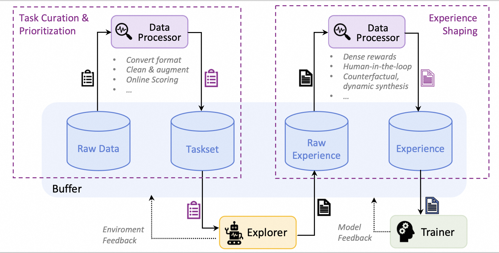

<!--  -->

<div align="center">
  
</div>

&nbsp;


<h2 align="center">Trinity-RFT: A General-Purpose and Unified Framework for Reinforcement Fine-Tuning of Large Language Models</h2>


<div align="center">

[](https://arxiv.org/abs/2505.17826)
[](https://modelscope.github.io/Trinity-RFT/)
[](https://pypi.org/project/trinity-rft/)


</div>


## News

* [2025-07] We update the [technical report](https://arxiv.org/abs/2505.17826) (arXiv v2) with new features, examples, and experiments.
* [2025-06] Trinity-RFT v0.2.0 is released.
* [2025-05] We release Trinity-RFT v0.1.0 and a technical report.
* [2025-04] The initial codebase of Trinity-RFT is open.


## What is Trinity-RFT, and why?


Trinity-RFT is a general-purpose, flexible and easy-to-use framework for reinforcement fine-tuning (RFT) of large language models (LLM).
It can be easily adapted for diverse application scenarios, and serve as a unified platform for exploring advanced RL paradigms in the [era of experience](https://storage.googleapis.com/deepmind-media/Era-of-Experience%20/The%20Era%20of%20Experience%20Paper.pdf).


### Key Features

* **An RFT-core that unifies and generalizes diverse RL modes:**
supports synchronous/asynchronous, on-policy/off-policy, and online/offline training;
allows rollout and training to run separately and scale up independently on different devices.

* **Agent-environment interaction as a first-class citizen:**
gracefully handles challenges like lagged environmental feedback, long-tailed latencies, and environment/agent failures.

* **Systematic data pipelines optimized for RFT:**
regards rollout tasks and experiences as dynamic assets to be actively managed (e.g., prioritization, cleaning, augmentation) throughout the RFT lifecycle.

* **User-friendliness as a top priority:**
modular and decoupled design for easy adoption and development;
rich graphical user interfaces for low-code usage.


<p align="center">
  
  <em>The high-level design of Trinity-RFT</em>
</p>


### What can I use Trinity-RFT for?


* Adapt Trinity-RFT to a new application domain, by implementing the logic of agent-environment interaction in a single `Workflow` or `MultiTurnWorkflow` class ([Example](./docs/sphinx_doc/source/tutorial/example_multi_turn.md))


* Develop your own RL algorithms (e.g., loss design, sampling strategies, data processing) in a few compact plug-and-play classes, with minimal code duplication or intrusive changes to the codebase ([Example](./docs/sphinx_doc/source/tutorial/example_mix_algo.md))


* Use the rich set of graphical user interfaces for low-code usage or development, with easy monitoring and tracking of the learning process


## Table of contents

- [Getting started](#getting-started)
  - [Step 1: preparations](#step-1-preparations)
  - [Step 2: prepare dataset and model](#step-2-prepare-dataset-and-model)
  - [Step 3: configurations](#step-3-configurations)
  - [Step 4: run the RFT process](#step-4-run-the-rft-process)
- [Further examples](#further-examples)
- [Documentation](#documentation)
  - [Advanced usage and full configurations](#advanced-usage-and-full-configurations)
  - [Programming guide for developers](#programming-guide-for-developers)
  - [Details: design and implementations](#details-design-and-implementations)
- [Upcoming features](#upcoming-features)
- [Contribution guide](#contribution-guide)
- [Acknowledgements](#acknowledgements)
- [Citation](#citation)


## Getting started


> [!NOTE]
> This project is currently under active development. Comments and suggestions are welcome!


### Step 1: preparations


Installation from source (recommended):

```shell
# Pull the source code from GitHub
git clone https://github.com/modelscope/Trinity-RFT
cd Trinity-RFT

# Create a new environment using Conda or venv
# Option 1: Conda
conda create -n trinity python=3.10
conda activate trinity

# Option 2: venv
python3.10 -m venv .venv
source .venv/bin/activate

# Install the package in editable mode
# for bash
pip install -e .[dev]
# for zsh
pip install -e .\[dev\]

# Install flash-attn after all dependencies are installed
# Note: flash-attn will take a long time to compile, please be patient.
# for bash
pip install -e .[flash_attn]
# for zsh
pip install -e .\[flash_attn\]
# Try the following command if you encounter errors during flash-attn installation
# pip install flash-attn -v --no-build-isolation
```

Installation using pip:

```shell
pip install trinity-rft==0.1.1
```

Installation from docker:
we have provided a dockerfile for Trinity-RFT (trinity)

```shell
git clone https://github.com/modelscope/Trinity-RFT
cd Trinity-RFT

# build the docker image
# Note: you can edit the dockerfile to customize the environment
# e.g., use pip mirrors or set api key
docker build -f scripts/docker/Dockerfile -t trinity-rft:latest .

# run the docker image
docker run -it --gpus all --shm-size="64g" --rm -v $PWD:/workspace -v <root_path_of_data_and_checkpoints>:/data trinity-rft:latest
```


Trinity-RFT requires
Python version >= 3.10,
CUDA version >= 12.4,
and at least 2 GPUs.


### Step 2: prepare dataset and model


Trinity-RFT supports most datasets and models from Huggingface and ModelScope.


**Prepare the model** in the local directory `$MODEL_PATH/{model_name}`:

```bash
# Using Huggingface
huggingface-cli download {model_name} --local-dir $MODEL_PATH/{model_name}

# Using Modelscope
modelscope download {model_name} --local_dir $MODEL_PATH/{model_name}
```

For more details about model downloading, please refer to [Huggingface](https://huggingface.co/docs/huggingface_hub/main/en/guides/cli) or  [ModelScope](https://modelscope.cn/docs/models/download).


**Prepare the dataset** in the local directory `$DATASET_PATH/{dataset_name}`:

```bash
# Using Huggingface
huggingface-cli download {dataset_name} --repo-type dataset --local-dir $DATASET_PATH/{dataset_name}

# Using Modelscope
modelscope download --dataset {dataset_name} --local_dir $DATASET_PATH/{dataset_name}
```

For more details about dataset downloading, please refer to [Huggingface](https://huggingface.co/docs/huggingface_hub/main/en/guides/cli#download-a-dataset-or-a-space) or [ModelScope](https://modelscope.cn/docs/datasets/download).


### Step 3: configurations


For convenience, Trinity-RFT provides a web interface for configuring your RFT process.

> [!NOTE]
> This is an experimental feature, and we will continue to improve it.


To enable *minimal* features (mainly for trainer), you can run
```bash
trinity studio --port 8080
```
Then you can configure your RFT process in the web page and generate a config file. You can save the config for later use or run it directly as described in the following section.

Advanced users can also configure the RFT process by editing the config file directly.
We provide a set of example config files in [`examples`](examples/).

To enable *complete* visualization features, please refer to the monorepo for [Trinity-Studio](https://github.com/modelscope/Trinity-Studio).


### Step 4: run the RFT process


First, start a ray cluster with the following command:

```shell
# On master node
ray start --head

# On worker nodes
ray start --address=<master_address>
```

Optionally, we can login into [wandb](https://docs.wandb.ai/quickstart/) to better monitor the RFT process:

```shell
export WANDB_API_KEY=<your_api_key>
wandb login
```

Then, for command-line users, run the RFT process with the following command:

```shell
trinity run --config <config_path>
```

For example, below is the command for fine-tuning Qwen2.5-1.5B-Instruct on GSM8k dataset using GRPO algorithm:
```shell
trinity run --config examples/grpo_gsm8k/gsm8k.yaml
```

For studio users, just click the "Run" button in the web page.


## Further examples

For more detailed examples about how to use Trinity-RFT, please refer to the following tutorials:
+ [A quick example with GRPO and GSM8k](./docs/sphinx_doc/source/tutorial/example_reasoning_basic.md)
+ [Off-policy mode of RFT](./docs/sphinx_doc/source/tutorial/example_reasoning_advanced.md)
+ [Fully asynchronous mode of RFT](./docs/sphinx_doc/source/tutorial/example_async_mode.md)
+ [Multi-turn tasks](./docs/sphinx_doc/source/tutorial/example_multi_turn.md)
+ [Offline learning by DPO or SFT](./docs/sphinx_doc/source/tutorial/example_dpo.md)
+ [Advanced data processing / human-in-the-loop](./docs/sphinx_doc/source/tutorial/example_data_functionalities.md)
+ [RL Algorithm development with Trinity-RFT](./docs/sphinx_doc/source/tutorial/example_mix_algo.md)


For some frequently asked questions, see [FAQ](./docs/sphinx_doc/source/tutorial/faq.md).


## Documentation


### Advanced usage and full configurations


Please refer to [this document](./docs/sphinx_doc/source/tutorial/trinity_configs.md).


### Programming guide for developers


Please refer to [this document](./docs/sphinx_doc/source/tutorial/trinity_programming_guide.md).


### Details: design and implementations


<p align="center">
  
  <em>The architecture of RFT-core</em>
</p>

<!--  -->


<p align="center">
  
  <em>Some RFT modes supported by Trinity-RFT</em>
</p>

<!--  -->


<p align="center">
  
  <em>The architecture of data processors</em>
</p>

<!--  -->


<p align="center">
  
  <em>The high-level design of data pipelines in Trinity-RFT</em>
</p>


## Upcoming features

A tentative roadmap: [#51](https://github.com/modelscope/Trinity-RFT/issues/51)


## Contribution guide


This project is currently under active development, and we welcome contributions from the community!


Code style check:

```shell
pre-commit run --all-files
```


Unit tests:

```shell
python -m pytest tests
```


## Acknowledgements


This project is built upon many excellent open-source projects, including:

+ [verl](https://github.com/volcengine/verl) and [PyTorch's FSDP](https://pytorch.org/docs/stable/fsdp.html) for LLM training;
+ [vLLM](https://github.com/vllm-project/vllm) for LLM inference;
+ [Data-Juicer](https://github.com/modelscope/data-juicer?tab=readme-ov-file) for data processing pipelines;
+ [AgentScope](https://github.com/modelscope/agentscope) for agentic workflow;
+ [Ray](https://github.com/ray-project/ray) for distributed systems;
+ we have also drawn inspirations from RL frameworks like [OpenRLHF](https://github.com/OpenRLHF/OpenRLHF), [TRL](https://github.com/huggingface/trl) and [ChatLearn](https://github.com/alibaba/ChatLearn);
+ ......

## Citation


```plain
@misc{trinity-rft,
      title={Trinity-RFT: A General-Purpose and Unified Framework for Reinforcement Fine-Tuning of Large Language Models},
      author={Xuchen Pan and Yanxi Chen and Yushuo Chen and Yuchang Sun and Daoyuan Chen and Wenhao Zhang and Yuexiang Xie and Yilun Huang and Yilei Zhang and Dawei Gao and Yaliang Li and Bolin Ding and Jingren Zhou},
      year={2025},
      eprint={2505.17826},
      archivePrefix={arXiv},
      primaryClass={cs.LG},
      url={https://arxiv.org/abs/2505.17826},
}
```
