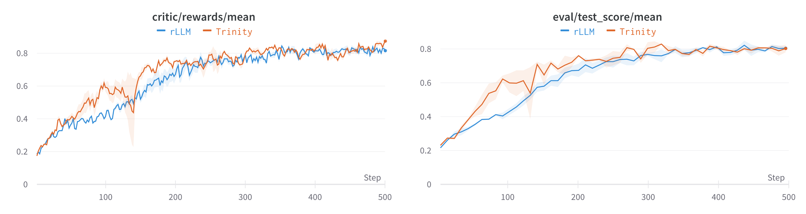

# Frozen Lake Benchmark Results

## 1. Task Introduction

[Frozen lake](https://gymnasium.farama.org/environments/toy_text/frozen_lake/) involves walking over a frozen lake from Start (S) to Goal (G) without falling into any Holes (H). We formulate this task as a multi-step workflow, where the agent interacts with the environment for multiple steps to reach the goal.

The environment is configured as follows:
* Map Size: From 2x2 to 5x5, randomly generated.
* Mode: Non-Slippery
* Action Space: Up, Down, Left, Right
* Reward Structure: +1 for reaching the goal, 0 otherwise.

The training and test data are generated by the following script:
```bash
python examples/grpo_frozen_lake/get_frozen_lake_data.py
```
This command generates 10000 training tasks and 100 test tasks.

To filter the unsolvable tasks, we restrict the game map to have a valid path within `env_map_steps=8` steps. Moreover, the agent can take at most `agent_max_steps=10` steps to reach the goal.


## 2. Experimental Settings

We evaluate the performance of the following methods in Trinity-RFT framework with version [0.3.3](https://github.com/agentscope-ai/Trinity-RFT/releases/tag/v0.3.3) (verl==0.5.0, vllm==0.11.0) and compare against the latest release of rLLM with commit ID [ef6451f](https://github.com/rllm-org/rllm/commit/ef6451fbd7eba224c4a87e3fd944d7c0e2bcc0ea) (verl==0.5.0) as of Nov. 6, 2025.

We fine-tune a Qwen2.5-3B-Instruct model using the training tasks with GRPO. For all experiments, we fix key parameters to `batch_size=64`, `repeat_times=8`, and `lr=1e-6`. We run each experiment for three times and report the average results.

For fair comparison, we optimize the configurations related to the training efficiency to achieve better performance. For rLLM, we adopt the default configurations in ` examples/frozenlake/train_frozenlake_agent.sh` except that we increase the batch size to 64 for stability and set the number of rollout workers to 64 for efficiency. For Trinity-RFT, we set the `explorer.engine_num` to 4 for efficiency.

## 3. Results and Analysis

We compare the sample efficiency of different methods by plotting the reward and test score in the following figures. At the same step, Trinity-RFT and rLLM achieve similar rewards and test scores, verifying the training correctness.



The following table details the wall-clock time required for each method to reach a specific performance threshold. From the results, Trinity-RFT requires less time to reach the target performance, i.e., reward=0.6, reward=0.8, and test score=0.8.

| Method | Training Reward | Time to Reach Target (Hours) | Speedup |
|----------|------------------|-------------------------------|---------|
| rLLM | 0.6023 | 3.967 | - |
| Trinity-RFT | 0.6188 | 2.87 | 1.38× |
| rLLM | 0.8007 | 5.91 | - |
| Trinity-RFT | 0.8033 | 5.44 | 1.09× |

| Method | Test Score | Time to Reach Target (Hours) | Speedup |
|----------|------------------|-------------------------------|---------|
| rLLM | 0.8096 | 6.82 | - |
| Trinity-RFT | 0.8262 | 5.15 | 1.32× |
