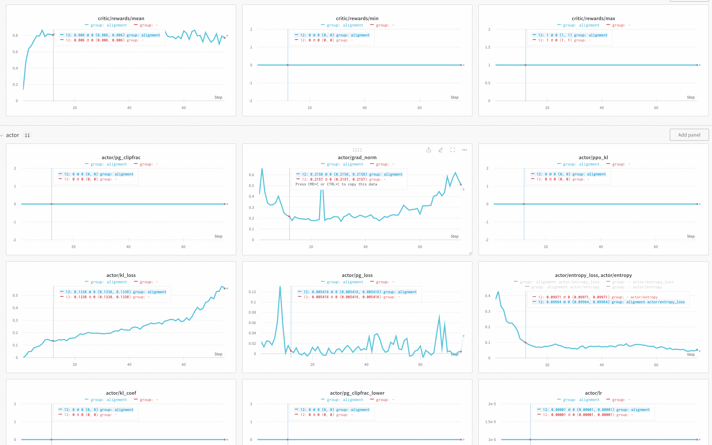
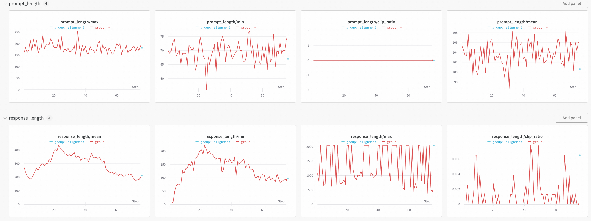
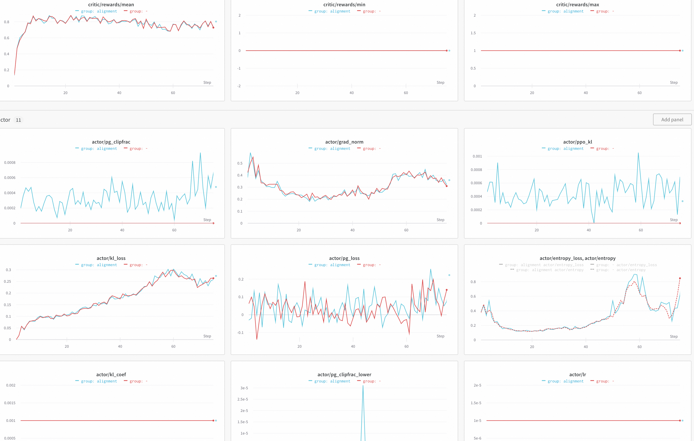
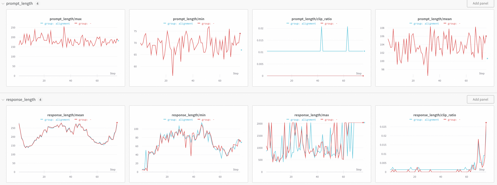
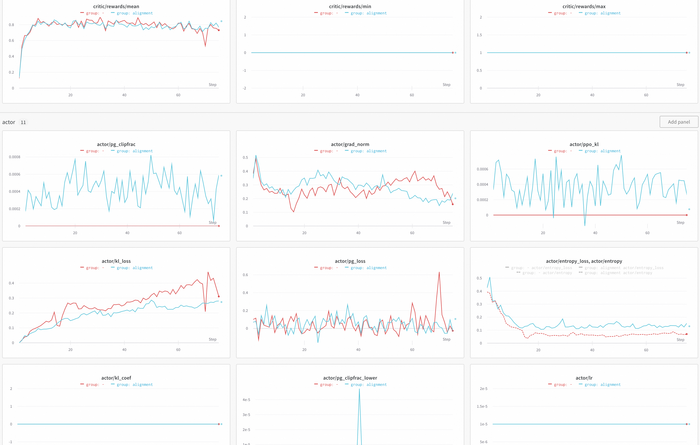
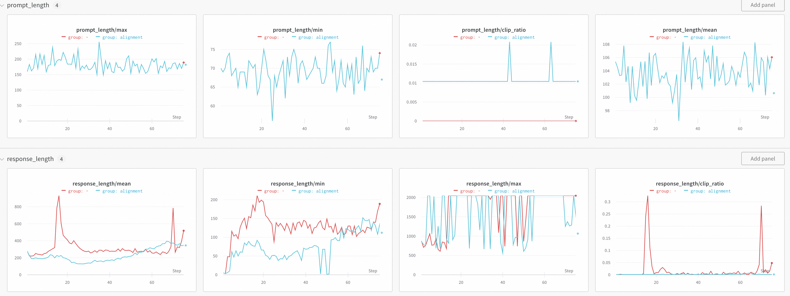
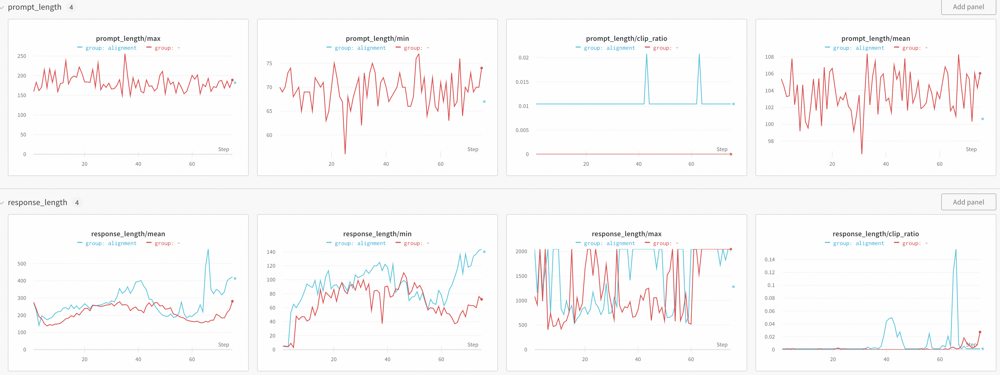

# GSM8K Benchmark Results

## 1. Task Overview

[GSM8K](https://huggingface.co/datasets/openai/gsm8k) is a dataset comprising over 8,500 high-school-level mathematics word problems. Each problem is accompanied by a detailed, step-by-step solution that includes intermediate calculations. The task requires the model to generate such a complete reasoning trace from the problem statement alone.

---

## 2. Experimental Setup

Due to inherent stochasticity in both vLLM-based rollouts and the training process itself, we designed four controlled experiments to isolate sources of divergence and ensure a fair comparison between **veRL** and **Trinity**:

- **Experiment 1 (Exact Reproduction)**: veRL saves both the input batch and the full model/optimizer state at every `update_actor` step. Trinity loads both artifacts to exactly reproduce veRL’s training trajectory.
- **Experiment 2 (State-Aligned Training)**: veRL saves only the model and optimizer states after each step. Trinity loads these states but generates its own rollout data (i.e., does not reuse veRL’s input batches).
- **Experiment 3 (Independent Training, Zero Regularization)**: Both frameworks train independently with identical hyperparameters and regularization coefficients set to zero (kl_loss_coef = entropy_coef = 0), allowing divergence from both rollouts and training dynamics.
- **Experiment 4 (Independent Training, Non-zero Regularization)**: Identical to Experiment 3 but with active regularization (kl_loss_coef = 0.001, entropy_coef = 0.003).

To enable these comparisons, targeted modifications were made to both codebases as detailed below.

---

### Code Modifications

#### veRL Modifications

- **`protocol.py`**: Fixed a bug in `DataProto.concat()` (present in `verl < 0.6.0`) related to aggregating `meta_info`. The fix aligns with the official `verl==0.6.0` implementation.
- **`ray_trainer.py`**: Added logic to save the actor’s input batch at every training step.
- **`fsdp_workers.py`**: Adjusted implementation to match Trinity (specifically, commented out a type conversion to avoid potential numerical discrepancies).

> ⚠️ **Note**: All `batch_file` paths are relative local paths. Users must adjust them according to their runtime environment.

<details><summary>Click to expand patch</summary>

```patch
diff --git a/verl/protocol.py b/verl/protocol.py
index 39979f84..8ea485b5 100644
--- a/verl/protocol.py
+++ b/verl/protocol.py
@@ -758,8 +758,32 @@ class DataProto:
         for key, val in non_tensor_batch.items():
             non_tensor_batch[key] = np.concatenate(val, axis=0)

+        # Merge meta_info with special handling for metrics
+        merged_meta_info = {}
+        if data:
+            # Merge non-metric meta_info and aggregate metrics from all workers.
+            all_metrics = []
+            for d in data:
+                for k, v in d.meta_info.items():
+                    if k == "metrics":
+                        if v is not None:
+                            if isinstance(v, list):
+                                all_metrics.extend(v)
+                            else:
+                                all_metrics.append(v)
+                    else:
+                        if k in merged_meta_info:
+                            # Ensure consistency for overlapping non-metric keys
+                            assert merged_meta_info[k] == v, f"Conflicting values for meta_info key '{k}'"
+                        else:
+                            merged_meta_info[k] = v
+
+            # Flatten list of dicts to dict of lists for consistent metrics structure
+            if all_metrics:
+                merged_meta_info["metrics"] = list_of_dict_to_dict_of_list(all_metrics)
+
         cls = type(data[0]) if len(data) > 0 else DataProto
-        return cls(batch=new_batch, non_tensor_batch=non_tensor_batch, meta_info=data[0].meta_info)
+        return cls(batch=new_batch, non_tensor_batch=non_tensor_batch, meta_info=merged_meta_info)

     def reorder(self, indices):
         """
diff --git a/verl/trainer/ppo/ray_trainer.py b/verl/trainer/ppo/ray_trainer.py
index 45ed80a4..6458de18 100644
--- a/verl/trainer/ppo/ray_trainer.py
+++ b/verl/trainer/ppo/ray_trainer.py
@@ -1316,6 +1316,16 @@ class RayPPOTrainer:
                         critic_output_metrics = reduce_metrics(critic_output.meta_info["metrics"])
                         metrics.update(critic_output_metrics)

+                    import os, pickle, random
+                    batch_file = f'./data/step_{self.global_steps}.pkl'
+                    if os.path.exists(batch_file):
+                        with open(batch_file, 'rb') as f:
+                            batch = pickle.load(f)
+                    else:
+                        os.makedirs('./data/', exist_ok=True)
+                        with open(f'./data/step_{self.global_steps}.pkl', 'wb') as f:
+                            pickle.dump(batch, f)
+
                     # implement critic warmup
                     if self.config.trainer.critic_warmup <= self.global_steps:
                         # update actor
diff --git a/verl/workers/fsdp_workers.py b/verl/workers/fsdp_workers.py
index 4141d986..2895fe16 100644
--- a/verl/workers/fsdp_workers.py
+++ b/verl/workers/fsdp_workers.py
@@ -309,7 +309,7 @@ class ActorRolloutRefWorker(Worker, DistProfilerExtension):
             )

             # some parameters may not in torch_dtype. TODO(zhangchi.usc1992) remove this after we switch to fsdp2
-            actor_module.to(torch_dtype)
+            # actor_module.to(torch_dtype)

             if enable_gradient_checkpointing:
                 actor_module.gradient_checkpointing_enable(gradient_checkpointing_kwargs={"use_reentrant": False})
```

</details>

---

#### Trinity Modifications

The primary changes enable Trinity to load checkpoints and batch data saved by veRL:

- In `verl_trainer.py`, added logic to load veRL-saved input batches (used in Experiment 1).
- Implemented checkpoint loading for the actor model and optimizer state at corresponding training steps.

> ⚠️ **Note**: Both `batch_file` and `verl_checkpoint_folder` currently use hardcoded local paths for demonstration.
> - **Experiment 1** uses batch loading and checkpoint restoration as shown.
> - **Experiment 2** does not require batch loading; the relevant code should be disabled.
> - **Experiments 3 and 4** were run using the *original, unmodified* version of `verl_trainer.py` (i.e., without the changes in this patch). To reproduce those experiments, these modifications must be reverted or disabled.

<details><summary>Click to expand patch</summary>

```patch
diff --git a/trinity/trainer/verl_trainer.py b/trinity/trainer/verl_trainer.py
index 603f54c98e..805fb91683 100644
--- a/trinity/trainer/verl_trainer.py
+++ b/trinity/trainer/verl_trainer.py
@@ -464,6 +464,12 @@ class VerlPPOTrainerWrapper(RayPPOTrainer, TrainEngineWrapper):
                 critic_output_metrics = reduce_metrics(critic_output.meta_info["metrics"])
                 metrics.update(critic_output_metrics)

+            import pickle
+            batch_file = f'./data/step_{self.global_steps}.pkl'
+            if os.path.exists(batch_file):
+                self.logger.info(f'Load batch from {batch_file}')
+                with open(batch_file, 'rb') as f:
+                    batch = pickle.load(f)
             # implement critic warmup
             if (
                 not self.algorithm.use_critic
@@ -485,6 +491,16 @@ class VerlPPOTrainerWrapper(RayPPOTrainer, TrainEngineWrapper):
             compute_throughout_metrics(batch=batch, timing_raw=timing_raw, n_gpus=n_gpus)
         )

+        verl_checkpoint_folder = 'checkpoints/Trinity-RFT-cys-gsm8k/verl-unshuffle-0kl-0entropy-no_metric_bug-6gpu'
+        if not os.path.isabs(verl_checkpoint_folder):
+            working_dir = os.getcwd()
+            verl_checkpoint_folder = os.path.join(working_dir, verl_checkpoint_folder)
+        suffix = f'global_step_{self.global_steps}'
+        actor_checkpoint_path = os.path.join(verl_checkpoint_folder, suffix, 'actor')
+        self.logger.info(f"loading checkpoint from {actor_checkpoint_path}")
+        self.actor_rollout_wg.load_checkpoint(actor_checkpoint_path)
+        self.logger.info(f"loaded checkpoint from {actor_checkpoint_path}")
+
         return metrics

     def save_checkpoint(self, block_until_saved: bool = False, save_as_hf: bool = False) -> None:
```

</details>

Additionally, to ensure reward computation matches veRL exactly, we implemented a dedicated workflow `VerlGSM8kWorkflow` that reuses veRL’s GSM8K scoring logic:

<details><summary>Click to expand implementation</summary>

```python
from dataclasses import asdict
from typing import List, Optional

import openai
from trinity.common.experience import Experience
from trinity.common.models.model import ModelWrapper
from trinity.common.workflows.workflow import Task, Workflow

from verl.utils.reward_score import gsm8k


class VerlGSM8kWorkflow(Workflow):
    can_reset: bool = True
    can_repeat: bool = True

    def __init__(
        self,
        *,
        task: Task,
        model: ModelWrapper,
        auxiliary_models: Optional[List[ModelWrapper]] = None,
    ):
        self.reset(task)
        super().__init__(
            task=task,
            model=model,
            auxiliary_models=auxiliary_models,
        )

    def reset(self, task: Task):
        self.task = task
        self.raw_task = task.raw_task
        self.task_message = self.raw_task['prompt']
        self.truth = self.raw_task['reward_model']['ground_truth']

    def set_repeat_times(self, repeat_times, run_id_base):
        self.repeat_times = repeat_times
        self.task.rollout_args.n = repeat_times
        self.run_id_base = run_id_base

    @property
    def rollout_args(self):
        return asdict(self.task.rollout_args)

    def run(self) -> List[Experience]:
        messages = self.task_message

        self.logger.debug("start chat")
        responses = self.model.chat(messages, **self.rollout_args)
        for i, response in enumerate(responses):
            reward_dict = {
                "accuracy": gsm8k.compute_score(solution_str=response.response_text, ground_truth=self.truth),
            }

            if response.metrics is None:
                response.metrics = {}
            response.metrics.update(reward_dict)
            reward = sum(reward_dict.values())
            response.reward = reward
            response.eid.run = i + self.run_id_base

            self.logger.debug(
                f"self.task_message: {self.task_message}, messages: {messages}, response: {response.response_text}, reward: {reward}"
            )
        return responses
```

</details>

---

### Hardware Configuration

To ensure checkpoint compatibility, **both veRL and Trinity trainers were configured to use 6 GPUs**, despite Trinity’s YAML specifying `gpu_per_node=8`. Only 6 GPUs were actively used during training.

---

#### Experiment 1: Exact Training Trajectory Reproduction

<details><summary>veRL Launch Script</summary>

```bash
export MODEL_PATH=Qwen/Qwen2.5-1.5B-Instruct
project_name=Trinity-RFT-cys-gsm8k
exp_name=verl-unshuffle-0kl-0entropy-no_metric_bug-6gpu
PYTHONUNBUFFERED=1 python3 -m verl.trainer.main_ppo \
 algorithm.adv_estimator=grpo \
 algorithm.use_kl_in_reward=false \
 algorithm.kl_ctrl.kl_coef=0.001 \
 data.train_files=$HOME/data/gsm8k/train.parquet \
 data.val_files=$HOME/data/gsm8k/test.parquet \
 data.train_batch_size=96 \
 data.max_prompt_length=1024 \
 data.max_response_length=2048 \
 data.shuffle=false \
 actor_rollout_ref.model.use_remove_padding=true \
 actor_rollout_ref.actor.use_kl_loss=true \
 actor_rollout_ref.actor.kl_loss_coef=0.0 \
 actor_rollout_ref.actor.kl_loss_type=low_var_kl \
 actor_rollout_ref.actor.entropy_coeff=0.0 \
 actor_rollout_ref.model.path=$MODEL_PATH \
 actor_rollout_ref.actor.strategy=fsdp \
 actor_rollout_ref.actor.optim.lr=1e-5 \
 actor_rollout_ref.actor.ppo_mini_batch_size=96 \
 actor_rollout_ref.actor.use_dynamic_bsz=true \
 actor_rollout_ref.actor.ppo_max_token_len_per_gpu=16384 \
 actor_rollout_ref.actor.clip_ratio_low=0.2 \
 actor_rollout_ref.actor.clip_ratio_high=0.28 \
 actor_rollout_ref.actor.loss_agg_mode="token-mean" \
 actor_rollout_ref.rollout.name=vllm \
 actor_rollout_ref.rollout.log_prob_micro_batch_size_per_gpu=8 \
 actor_rollout_ref.rollout.tensor_model_parallel_size=1 \
 actor_rollout_ref.rollout.gpu_memory_utilization=0.4 \
 actor_rollout_ref.rollout.n=8 \
 actor_rollout_ref.ref.log_prob_use_dynamic_bsz=true \
 actor_rollout_ref.ref.log_prob_max_token_len_per_gpu=16384 \
 trainer.logger=wandb \
 trainer.project_name=$project_name \
 trainer.experiment_name=$exp_name \
 trainer.val_before_train=false \
 trainer.n_gpus_per_node=6 \
 trainer.nnodes=1 \
 trainer.save_freq=1 \
 trainer.test_freq=1000 \
 trainer.total_epochs=1 2>&1 | tee verl_gsm8k.log
```

</details>

<details><summary>Trinity Configuration (YAML)</summary>

```yaml
mode: both
project: Trinity-RFT-cys-gsm8k
group: alignment
name: 0-kl-0-entropy-fixed_input-no_metric_bug-load_checkpoint
checkpoint_root_dir: ./checkpoints/
algorithm:
  algorithm_type: grpo
  repeat_times: 8
  sample_strategy: default
  kl_loss_fn: low_var_kl
  kl_loss_fn_args:
    kl_coef: 0  # 0.001
  policy_loss_fn_args:
    clip_range_low: 0.2
    clip_range_high: 0.28
  entropy_loss_fn: default
  entropy_loss_fn_args:
    entropy_coef: 0  # 0.003
  optimizer:
    lr: 1.0e-05
    lr_warmup_steps_ratio: 0.0
    warmup_style: constant
data_processor: {}
model:
  model_path: Qwen/Qwen2.5-1.5B-Instruct
  max_prompt_tokens: 1024
  max_response_tokens: 2048
cluster:
  node_num: 1
  gpu_per_node: 8
buffer:
  batch_size: 96
  total_epochs: 1
  explorer_input:
    taskset:
      name: taskset
      storage_type: file
      path: /root/data/gsm8k
      split: train
      format:
        prompt_key: question
        response_key: answer
      rollout_args:
        temperature: 1.0
        logprobs: 0
    eval_tasksets: []
    default_workflow_type: verl_gsm8k_workflow
  trainer_input:
    experience_buffer:
      name: experience_buffer
      storage_type: queue
      replay_buffer:
        enable: false
        priority_fn: linear_decay
        reuse_cooldown_time: null
        priority_fn_args:
          decay: 2.0
explorer:
  runner_per_model: 8
  rollout_model:
    engine_num: 2
    tensor_parallel_size: 1
    enforce_eager: true
    enable_prefix_caching: false
    enable_chunked_prefill: false
    gpu_memory_utilization: 0.9
    dtype: bfloat16
    seed: 42
    enable_thinking: false
    enable_history: false
    enable_openai_api: false
    enable_auto_tool_choice: false
    tool_call_parser: null
    reasoning_parser: null
  auxiliary_models: []
  eval_interval: 1000
trainer:
  trainer_type: verl
  save_interval: 100
  enable_preview: true
  grad_clip: 1.0
  max_token_len_per_gpu: 16384
monitor:
  monitor_type: wandb
synchronizer:
  sync_method: nccl
  sync_style: fixed
  sync_interval: 1
  sync_timeout: 1200
log:
  level: INFO
```

</details>

---

#### Experiment 2: Model State Alignment with Independent Rollouts

<details><summary>veRL Launch Script</summary>

```bash
export MODEL_PATH=Qwen/Qwen2.5-1.5B-Instruct
project_name=Trinity-RFT-cys-gsm8k
exp_name=verl-unshuffle-6gpu
PYTHONUNBUFFERED=1 python3 -m verl.trainer.main_ppo \
 algorithm.adv_estimator=grpo \
 algorithm.use_kl_in_reward=false \
 algorithm.kl_ctrl.kl_coef=0.001 \
 data.train_files=$HOME/data/gsm8k/train.parquet \
 data.val_files=$HOME/data/gsm8k/test.parquet \
 data.train_batch_size=96 \
 data.max_prompt_length=1024 \
 data.max_response_length=2048 \
 data.shuffle=false \
 actor_rollout_ref.model.use_remove_padding=true \
 actor_rollout_ref.actor.use_kl_loss=true \
 actor_rollout_ref.actor.kl_loss_coef=0.001 \
 actor_rollout_ref.actor.kl_loss_type=low_var_kl \
 actor_rollout_ref.actor.entropy_coeff=0.003 \
 actor_rollout_ref.model.path=$MODEL_PATH \
 actor_rollout_ref.actor.strategy=fsdp \
 actor_rollout_ref.actor.optim.lr=1e-5 \
 actor_rollout_ref.actor.ppo_mini_batch_size=96 \
 actor_rollout_ref.actor.use_dynamic_bsz=true \
 actor_rollout_ref.actor.ppo_max_token_len_per_gpu=16384 \
 actor_rollout_ref.actor.clip_ratio_low=0.2 \
 actor_rollout_ref.actor.clip_ratio_high=0.28 \
 actor_rollout_ref.actor.loss_agg_mode="token-mean" \
 actor_rollout_ref.rollout.name=vllm \
 actor_rollout_ref.rollout.log_prob_micro_batch_size_per_gpu=8 \
 actor_rollout_ref.rollout.tensor_model_parallel_size=1 \
 actor_rollout_ref.rollout.gpu_memory_utilization=0.4 \
 actor_rollout_ref.rollout.n=8 \
 actor_rollout_ref.ref.log_prob_use_dynamic_bsz=true \
 actor_rollout_ref.ref.log_prob_max_token_len_per_gpu=16384 \
 trainer.logger=wandb \
 trainer.project_name=$project_name \
 trainer.experiment_name=$exp_name \
 trainer.val_before_train=false \
 trainer.n_gpus_per_node=6 \
 trainer.nnodes=1 \
 trainer.save_freq=1 \
 trainer.test_freq=1000 \
 trainer.total_epochs=1 2>&1 | tee verl_gsm8k.log
```

</details>

<details><summary>Trinity Configuration (YAML)</summary>

```yaml
mode: both
project: Trinity-RFT-cys-gsm8k
group: alignment
name: load_checkpoint
checkpoint_root_dir: ./checkpoints/
algorithm:
  algorithm_type: grpo
  repeat_times: 8
  sample_strategy: default
  kl_loss_fn: low_var_kl
  kl_loss_fn_args:
    kl_coef: 0.001
  policy_loss_fn_args:
    clip_range_low: 0.2
    clip_range_high: 0.28
  entropy_loss_fn: default
  entropy_loss_fn_args:
    entropy_coef: 0.003
  optimizer:
    lr: 1.0e-05
    lr_warmup_steps_ratio: 0.0
    warmup_style: constant
data_processor: {}
model:
  model_path: Qwen/Qwen2.5-1.5B-Instruct
  max_prompt_tokens: 1024
  max_response_tokens: 2048
cluster:
  node_num: 1
  gpu_per_node: 8
buffer:
  batch_size: 96
  total_epochs: 1
  explorer_input:
    taskset:
      name: taskset
      storage_type: file
      path: /root/data/gsm8k
      split: train
      format:
        prompt_key: question
        response_key: answer
      rollout_args:
        temperature: 1.0
        logprobs: 0
    eval_tasksets: []
    default_workflow_type: verl_gsm8k_workflow
  trainer_input:
    experience_buffer:
      name: experience_buffer
      storage_type: queue
      replay_buffer:
        enable: false
        priority_fn: linear_decay
        reuse_cooldown_time: null
        priority_fn_args:
          decay: 2.0
explorer:
  runner_per_model: 8
  rollout_model:
    engine_num: 2
    tensor_parallel_size: 1
    enforce_eager: true
    enable_prefix_caching: false
    enable_chunked_prefill: false
    gpu_memory_utilization: 0.9
    dtype: bfloat16
    seed: 42
    enable_thinking: false
    enable_history: false
    enable_openai_api: false
    enable_auto_tool_choice: false
    tool_call_parser: null
    reasoning_parser: null
  auxiliary_models: []
  eval_interval: 1000
trainer:
  trainer_type: verl
  save_interval: 100
  enable_preview: true
  grad_clip: 1.0
  max_token_len_per_gpu: 16384
monitor:
  monitor_type: wandb
synchronizer:
  sync_method: nccl
  sync_style: fixed
  sync_interval: 1
  sync_timeout: 1200
log:
  level: INFO
```

</details>

---

#### Experiment 3: Independent Training, Zero Regularization

<details><summary>veRL Launch Script</summary>

```bash
export MODEL_PATH=Qwen/Qwen2.5-1.5B-Instruct
project_name=Trinity-RFT-cys-gsm8k
exp_name=verl-unshuffle-0kl-0entropy
PYTHONUNBUFFERED=1 python3 -m verl.trainer.main_ppo \
 algorithm.adv_estimator=grpo \
 algorithm.use_kl_in_reward=false \
 algorithm.kl_ctrl.kl_coef=0.001 \
 data.train_files=$HOME/data/gsm8k/train.parquet \
 data.val_files=$HOME/data/gsm8k/test.parquet \
 data.train_batch_size=96 \
 data.max_prompt_length=1024 \
 data.max_response_length=2048 \
 data.shuffle=false \
 actor_rollout_ref.model.use_remove_padding=true \
 actor_rollout_ref.actor.use_kl_loss=true \
 actor_rollout_ref.actor.kl_loss_coef=0.0 \
 actor_rollout_ref.actor.kl_loss_type=low_var_kl \
 actor_rollout_ref.actor.entropy_coeff=0.0 \
 actor_rollout_ref.model.path=$MODEL_PATH \
 actor_rollout_ref.actor.strategy=fsdp \
 actor_rollout_ref.actor.optim.lr=1e-5 \
 actor_rollout_ref.actor.ppo_mini_batch_size=96 \
 actor_rollout_ref.actor.use_dynamic_bsz=true \
 actor_rollout_ref.actor.ppo_max_token_len_per_gpu=16384 \
 actor_rollout_ref.actor.clip_ratio_low=0.2 \
 actor_rollout_ref.actor.clip_ratio_high=0.28 \
 actor_rollout_ref.actor.loss_agg_mode="token-mean" \
 actor_rollout_ref.rollout.name=vllm \
 actor_rollout_ref.rollout.log_prob_micro_batch_size_per_gpu=8 \
 actor_rollout_ref.rollout.tensor_model_parallel_size=1 \
 actor_rollout_ref.rollout.gpu_memory_utilization=0.4 \
 actor_rollout_ref.rollout.n=8 \
 actor_rollout_ref.ref.log_prob_use_dynamic_bsz=true \
 actor_rollout_ref.ref.log_prob_max_token_len_per_gpu=16384 \
 trainer.logger=wandb \
 trainer.project_name=$project_name \
 trainer.experiment_name=$exp_name \
 trainer.val_before_train=false \
 trainer.n_gpus_per_node=6 \
 trainer.nnodes=1 \
 trainer.save_freq=1 \
 trainer.test_freq=1000 \
 trainer.total_epochs=1 2>&1 | tee verl_gsm8k.log
```

</details>

<details><summary>Trinity Configuration (YAML)</summary>

```yaml
mode: both
project: Trinity-RFT-cys-gsm8k
group: alignment
name: vanilla-0kl-0entropy
checkpoint_root_dir: ./checkpoints/
algorithm:
  algorithm_type: grpo
  repeat_times: 8
  sample_strategy: default
  kl_loss_fn: low_var_kl
  kl_loss_fn_args:
    kl_coef: 0.0
  policy_loss_fn_args:
    clip_range_low: 0.2
    clip_range_high: 0.28
  entropy_loss_fn: default
  entropy_loss_fn_args:
    entropy_coef: 0.0
  optimizer:
    lr: 1.0e-05
    lr_warmup_steps_ratio: 0.0
    warmup_style: constant
data_processor: {}
model:
  model_path: Qwen/Qwen2.5-1.5B-Instruct
  max_prompt_tokens: 1024
  max_response_tokens: 2048
cluster:
  node_num: 1
  gpu_per_node: 8
buffer:
  batch_size: 96
  total_epochs: 1
  explorer_input:
    taskset:
      name: taskset
      storage_type: file
      path: /root/data/gsm8k
      split: train
      format:
        prompt_key: question
        response_key: answer
      rollout_args:
        temperature: 1.0
        logprobs: 0
    eval_tasksets: []
    default_workflow_type: verl_gsm8k_workflow
  trainer_input:
    experience_buffer:
      name: experience_buffer
      storage_type: queue
      replay_buffer:
        enable: false
        priority_fn: linear_decay
        reuse_cooldown_time: null
        priority_fn_args:
          decay: 2.0
explorer:
  runner_per_model: 8
  rollout_model:
    engine_num: 2
    tensor_parallel_size: 1
    enforce_eager: true
    enable_prefix_caching: false
    enable_chunked_prefill: false
    gpu_memory_utilization: 0.9
    dtype: bfloat16
    seed: 42
    enable_thinking: false
    enable_history: false
    enable_openai_api: false
    enable_auto_tool_choice: false
    tool_call_parser: null
    reasoning_parser: null
  auxiliary_models: []
  eval_interval: 1000
trainer:
  trainer_type: verl
  save_interval: 100
  enable_preview: true
  grad_clip: 1.0
  max_token_len_per_gpu: 16384
monitor:
  monitor_type: wandb
synchronizer:
  sync_method: nccl
  sync_style: fixed
  sync_interval: 1
  sync_timeout: 1200
log:
  level: INFO
```

</details>


#### Experiment 4: Independent Training, Non-zero Regularization

<details><summary>veRL Launch Script</summary>

```bash
export MODEL_PATH=Qwen/Qwen2.5-1.5B-Instruct
project_name=Trinity-RFT-cys-gsm8k
exp_name=verl-unshuffle
PYTHONUNBUFFERED=1 python3 -m verl.trainer.main_ppo \
 algorithm.adv_estimator=grpo \
 algorithm.use_kl_in_reward=false \
 algorithm.kl_ctrl.kl_coef=0.001 \
 data.train_files=$HOME/data/gsm8k/train.parquet \
 data.val_files=$HOME/data/gsm8k/test.parquet \
 data.train_batch_size=96 \
 data.max_prompt_length=1024 \
 data.max_response_length=2048 \
 data.shuffle=false \
 actor_rollout_ref.model.use_remove_padding=true \
 actor_rollout_ref.actor.use_kl_loss=true \
 actor_rollout_ref.actor.kl_loss_coef=0.001 \
 actor_rollout_ref.actor.kl_loss_type=low_var_kl \
 actor_rollout_ref.actor.entropy_coeff=0.003 \
 actor_rollout_ref.model.path=$MODEL_PATH \
 actor_rollout_ref.actor.strategy=fsdp \
 actor_rollout_ref.actor.optim.lr=1e-5 \
 actor_rollout_ref.actor.ppo_mini_batch_size=96 \
 actor_rollout_ref.actor.use_dynamic_bsz=true \
 actor_rollout_ref.actor.ppo_max_token_len_per_gpu=16384 \
 actor_rollout_ref.actor.clip_ratio_low=0.2 \
 actor_rollout_ref.actor.clip_ratio_high=0.28 \
 actor_rollout_ref.actor.loss_agg_mode="token-mean" \
 actor_rollout_ref.rollout.name=vllm \
 actor_rollout_ref.rollout.log_prob_micro_batch_size_per_gpu=8 \
 actor_rollout_ref.rollout.tensor_model_parallel_size=1 \
 actor_rollout_ref.rollout.gpu_memory_utilization=0.4 \
 actor_rollout_ref.rollout.n=8 \
 actor_rollout_ref.ref.log_prob_use_dynamic_bsz=true \
 actor_rollout_ref.ref.log_prob_max_token_len_per_gpu=16384 \
 trainer.logger=wandb \
 trainer.project_name=$project_name \
 trainer.experiment_name=$exp_name \
 trainer.val_before_train=false \
 trainer.n_gpus_per_node=6 \
 trainer.nnodes=1 \
 trainer.save_freq=1 \
 trainer.test_freq=1000 \
 trainer.total_epochs=1 2>&1 | tee verl_gsm8k.log
```

</details>

<details><summary>Trinity Configuration (YAML)</summary>

```yaml
mode: both
project: Trinity-RFT-cys-gsm8k
group: alignment
name: vanilla
checkpoint_root_dir: ./checkpoints/
algorithm:
  algorithm_type: grpo
  repeat_times: 8
  sample_strategy: default
  kl_loss_fn: low_var_kl
  kl_loss_fn_args:
    kl_coef: 0.001
  policy_loss_fn_args:
    clip_range_low: 0.2
    clip_range_high: 0.28
  entropy_loss_fn: default
  entropy_loss_fn_args:
    entropy_coef: 0.003
  optimizer:
    lr: 1.0e-05
    lr_warmup_steps_ratio: 0.0
    warmup_style: constant
data_processor: {}
model:
  model_path: Qwen/Qwen2.5-1.5B-Instruct
  max_prompt_tokens: 1024
  max_response_tokens: 2048
cluster:
  node_num: 1
  gpu_per_node: 8
buffer:
  batch_size: 96
  total_epochs: 1
  explorer_input:
    taskset:
      name: taskset
      storage_type: file
      path: /root/data/gsm8k
      split: train
      format:
        prompt_key: question
        response_key: answer
      rollout_args:
        temperature: 1.0
        logprobs: 0
    eval_tasksets: []
    default_workflow_type: verl_gsm8k_workflow
  trainer_input:
    experience_buffer:
      name: experience_buffer
      storage_type: queue
      replay_buffer:
        enable: false
        priority_fn: linear_decay
        reuse_cooldown_time: null
        priority_fn_args:
          decay: 2.0
explorer:
  runner_per_model: 8
  rollout_model:
    engine_num: 2
    tensor_parallel_size: 1
    enforce_eager: true
    enable_prefix_caching: false
    enable_chunked_prefill: false
    gpu_memory_utilization: 0.9
    dtype: bfloat16
    seed: 42
    enable_thinking: false
    enable_history: false
    enable_openai_api: false
    enable_auto_tool_choice: false
    tool_call_parser: null
    reasoning_parser: null
  auxiliary_models: []
  eval_interval: 1000
trainer:
  trainer_type: verl
  save_interval: 100
  enable_preview: true
  grad_clip: 1.0
  max_token_len_per_gpu: 16384
monitor:
  monitor_type: wandb
synchronizer:
  sync_method: nccl
  sync_style: fixed
  sync_interval: 1
  sync_timeout: 1200
log:
  level: INFO
```

</details>

---

### Results

The following figures compare the performance of Trinity (blue) and veRL (red).

#### Experiment 1: Identical Inputs and Model States





> ✅ The curves are nearly indistinguishable, confirming that under strictly controlled conditions—identical inputs and model states—Trinity and veRL exhibit virtually identical behavior, with only negligible floating-point discrepancies.

#### Experiment 2: Aligned Model States with Independent Rollouts (vLLM Stochasticity)





> 🔍 When only model states are synchronized, metrics such as `Reward`, `Grad Norm`, `Entropy`, and `KL loss` remain closely aligned. However, `PG loss` and `PPO KL` show slightly larger deviations—consistent with expectations, as these quantities are more sensitive to variations in rollout data.

#### Experiment 3: Independent Training, Zero Regularization





> Primary performance indicators (`Reward`, `Grad Norm`) maintain reasonable alignment, while secondary metrics (`Entropy`, `KL loss`, `PG loss`, `PPO KL`) demonstrate increased divergence due to compounded stochastic effects from both independent rollouts and optimization trajectories.


#### Experiment 4: Independent Training, Non-zero Regularization




> Similar to Experiment 3, fundamental metrics (`Reward`, `Grad Norm`) remain reasonably consistent between frameworks, while secondary metrics (`Entropy`, `KL loss`, `PG loss`, `PPO KL`) exhibit pronounced divergence attributable to accumulated stochastic variations in both data generation and parameter updates.

---

### Conclusion

Our comprehensive experimental evaluation demonstrates that Trinity and veRL produce functionally equivalent results on the GSM8K benchmark when configured identically. The observed behavioral consistency under controlled conditions (Experiment 1) validates the correctness of both implementations.

Divergences observed in less constrained experimental settings (Experiments 2-4) are attributable to expected sources of randomness—including vLLM sampling stochasticity and independent optimization trajectories—rather than fundamental implementation discrepancies.
