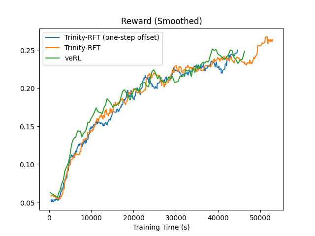
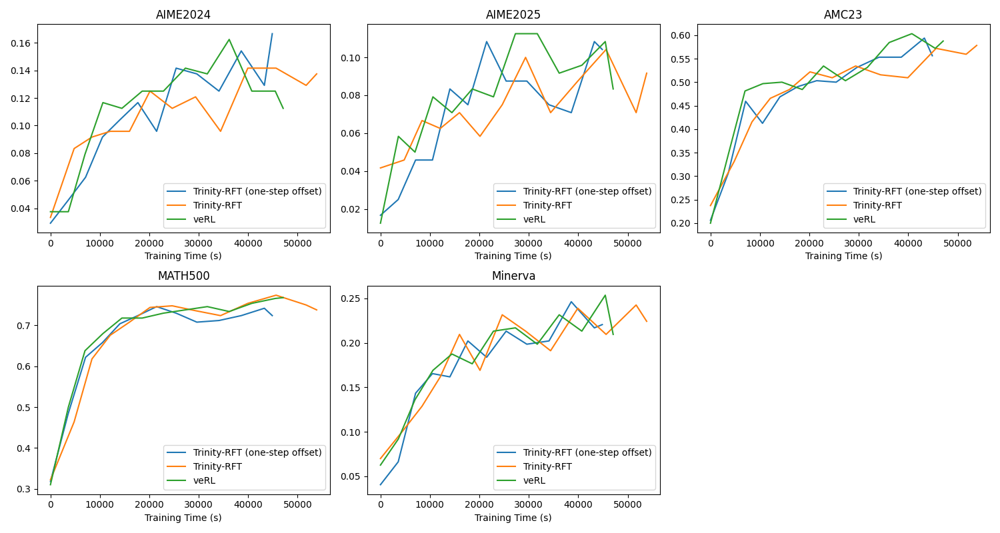

# Guru-Math Benchmark Results

## 1. Task Introduction

Guru-Math is the mathematics task derived from the [Guru](https://huggingface.co/datasets/LLM360/guru-RL-92k) dataset, comprising 54.4k samples. The data primarily focuses on competition-level problems and symbolic reasoning.

## 2. Experimental Settings

We evaluate the performance of the following methods within the Trinity-RFT framework using version [0.3.3](https://github.com/modelscope/Trinity-RFT/releases/tag/v0.3.3) (verl==0.5.0, vllm==0.10.2). For comparison, we ported relevant code from [Reasoning360](https://github.com/LLM360/Reasoning360) to be compatible with verl==0.5.0.

Within both Trinity-RFT and veRL, we evaluate performance using the GRPO algorithm on this task. We fine-tune a base `Qwen2.5-7B` model that has not undergone prior fine-tuning.

To ensure a fair comparison, Trinity-RFT employs the following training hyperparameters: `batch_size=60`, `sync_interval=8`, `lr_warmup_steps=80` (aligned with veRL's hyperparameters of `train_batch_size=480`, `ppo_mini_batch_size=60`, and `lr_warmup_steps=10`), `lr=1e-6`, `kl_coef=0.0`, `weight_decay=0.1`, and `total_epochs=1`. Additionally, to assess the impact of one-step offset training in Trinity-RFT, we conduct an extra experiment with `sync_offset=1` under the same configuration.

## 3. Results and Analysis

The table below presents a comparison of training times between Trinity-RFT and veRL on the Guru-Math dataset.

| Method | Training Time (seconds) | Relative Time (%) |
|--------|-------------------------|-------------------|
| veRL   | 47,123                  | 100.00            |
| Trinity-RFT | 54,045             | 114.69            |
| Trinity-RFT (one-step offset) | 45,053      | 95.61             |

The figure below shows the reward curve on the Guru-Math dataset.

To evaluate training effectiveness, we test models on the `AMC23`, `AIME2024`, `AIME2025`, `MATH500`, and `Minerva` benchmarks. The figure below compares the performance of checkpoints obtained from Trinity-RFT and veRL after training on the Guru-Math dataset. Each point in the plot corresponds to a checkpoint, with the x-axis representing its cumulative training time (in seconds) and the y-axis indicating its accuracy on the respective evaluation benchmark.

