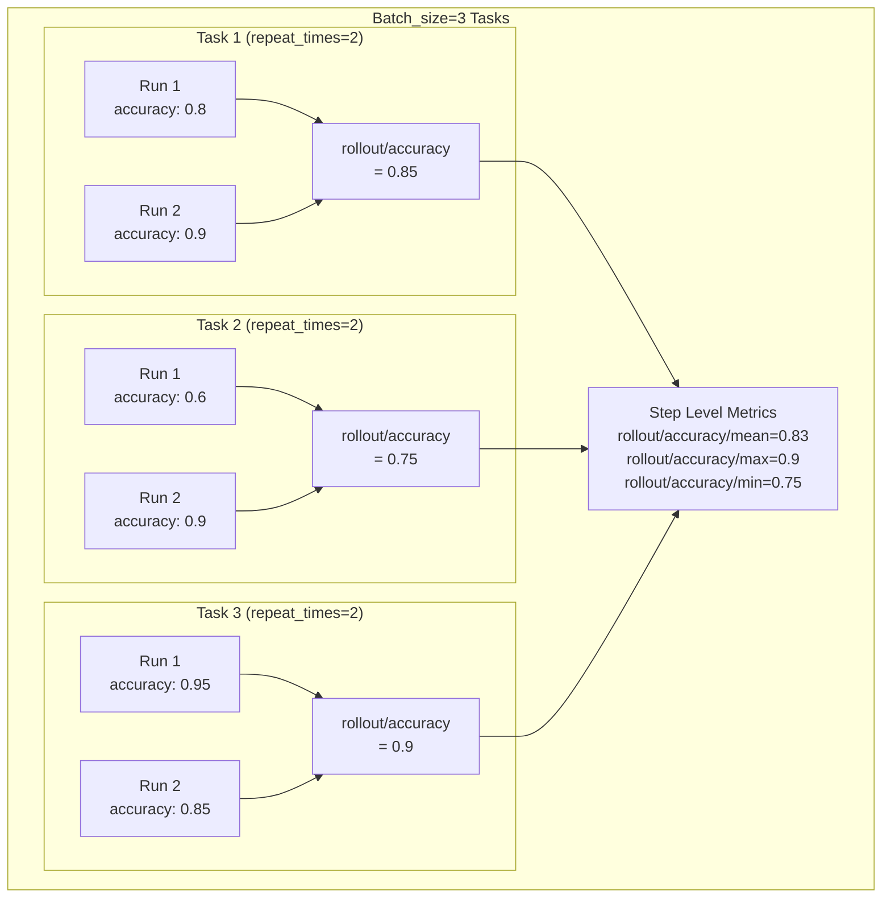
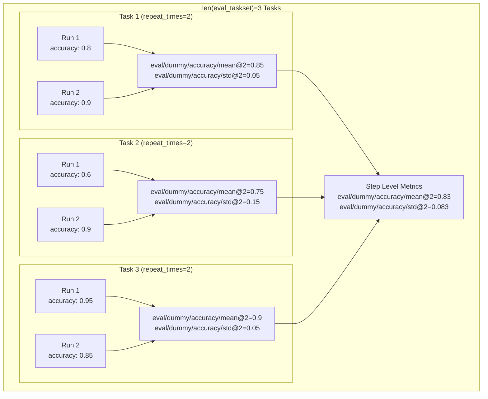
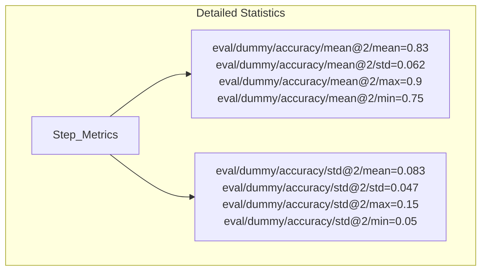
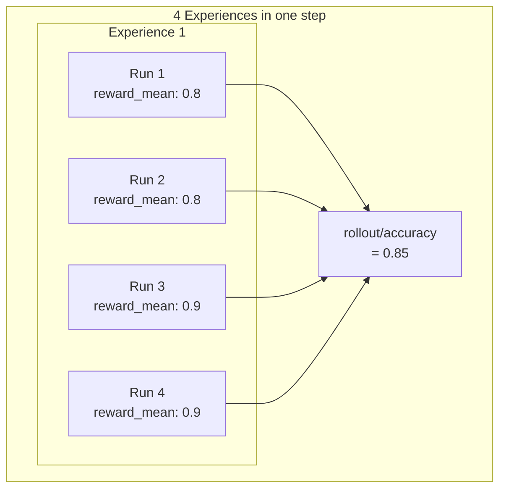

# 监控指标解释

本文档解释了 Trinity-RFT 中用于跟踪探索、评估和训练进度的指标类别。

## 指标命名规范

大多数指标遵循分层命名规范：`{category}/{taskset_name}/{metric_name}/{statistic}`

- **Category（类别）**：广泛的功能领域（rollout、eval、time、actor、critic 等）
- **Taskset name（任务集名称）**：使用的任务集名称，仅适用于评估阶段的指标
- **Metric name（指标名称）**：正在测量的具体指标
- **Statistic（统计量）**：统计指标（mean、max、min、std 等，如适用）

## 指标类别

以下内容按指标来源（生成位置）和指标前缀（指标名称的第一部分）对指标进行分类。

### Explorer 相关指标

Explorer 相关的指标发生在模型生成响应的 rollout 阶段，包括 rollout 指标（`rollout/`）、评估指标（`eval/`）和一些时间指标（`time/`）。

#### Rollout 指标（`rollout/`）

Rollout 指标跟踪模型生成响应的 rollout 阶段的性能。

- **格式**：`rollout/{metric_name}/{statistic}`
- **示例**：
  - `rollout/accuracy/mean`：生成响应的平均准确率
  - `rollout/format_score/mean`：平均格式正确性分数

**指标计算过程**：

考虑一个包含 `batch_size` 个任务的探索步骤，其中每个任务有 `repeat_times` 次运行。Rollout 指标（例如，`rollout/`）在不同级别的计算过程如下：

- 从*Experiences*到*Run 级别*（仅对 `can_repeat=False` 的 workflows 有效）：在 `calculate_run_level_metrics` 函数中，在每次 run 生成的所有 experiences 中求平均得到 run 级别指标。这通常是为了适应通用多轮场景，其中单个 run 可能产生多个 experiences。

- 从*Run 级别*到*Task 级别*：在 `calculate_task_level_metrics` 函数中，指标跨同一任务的 `repeat_times` 次运行聚合。例如，`rollout/accuracy` 是该任务所有运行的平均准确率。

- 从*Task 级别*到*Step 级别*：在 `gather_metrics` 函数中，指标跨步骤中所有任务聚合。例如，`rollout/accuracy/mean`、`rollout/accuracy/max`、`rollout/accuracy/min` 分别是步骤中所有任务的准确率（`rollout/accuracy`）的平均值、最大值和最小值。

以下图表说明了 rollout 指标的计算过程：

#### 评估指标（`eval/`）和基准测试指标（`bench/`）

评估指标衡量模型在保留的评估任务上的性能。这些指标在评估阶段的每次运行期间计算。

- **格式**：`eval/{task_name}/{metric_name}/{statistic}` 或 `bench/{task_name}/{metric_name}/{statistic}`
- **示例**：
  - `eval/gsm8k-eval/accuracy/mean@4`：跨 repeat_times=4 次运行的平均准确率
  - `bench/gsm8k-eval/accuracy/best@4`：跨 repeat_times=4 次运行的最佳准确率值

- **注意**：
  - Eval 和 bench 指标的计算方式相同，唯一的区别是指标名称的前缀。
  - 默认情况下，只返回指标的*平均值*。如果你想返回详细统计信息，可以在配置中将 `monitor.detailed_stats` 设置为 `True`。

**指标计算过程**：

考虑一个包含 `len(eval_taskset)` 个任务的评估步骤，其中每个任务有 `repeat_times` 次运行。评估指标（例如，`eval/`、`bench/`）在不同级别计算和聚合：

- 从*Experiences*到*Run 级别*（仅对 `can_repeat=False` 的 workflows 有效）：在 `calculate_run_level_metrics` 函数中，在每次 run 生成的所有 experiences 中求平均得到 run 级别指标。这通常是为了适应通用多轮场景，其中单个 run 可能产生多个 experiences。

- 从*Run 级别*到*Task 级别*：在 `calculate_task_level_metrics` 函数中，指标跨同一任务的 `repeat_times` 次运行聚合。例如，`eval/dummy/accuracy/mean@2` 是该任务所有运行的平均准确率。

- 从*Task 级别*到*Step 级别*：在 `gather_eval_metrics` 函数中，指标跨步骤中所有任务聚合。例如，`eval/dummy/accuracy/mean@2`、`eval/dummy/accuracy/std@2`、`eval/dummy/accuracy/best@2`、`eval/dummy/accuracy/worst@2` 分别是步骤中所有任务的准确率（`eval/dummy/accuracy`）的平均值、标准差、最佳值和最差值。

以下图表说明了在包含三个任务的虚拟数据集上评估指标的计算过程。默认情况下，报告所有评估任务中指标的 `mean@k`、`std@k`、`best@k`、`worst@k`。你可以在配置中将 `monitor.detailed_stats` 设置为 `True` 以返回详细统计信息。

当你将 `monitor.detailed_stats` 设置为 `True` 时，你会得到详细的统计信息，包括 mean、std、min、max，例如下面图表中给出的一些实例：

#### 时间指标（`time/`）

时间指标测量整个过程中各种操作的执行持续时间。

- **格式**：`time/{operation_name}`
- **示例**：
  - `time/eval`：从提交评估任务开始到评估阶段结束的时间；此持续时间包括评估任务和一些 rollout 任务。
  - `time/wait_explore_step`：等待一次 rollout 步骤完成的时间。

**注意**：
  - 由于 rollout 阶段的异步性质，时间测量的结果可能不太准确，但仍然可以用于监控整体训练进度。
  - 除非特殊说明，时间指标以秒为单位。
  - 一些训练操作还报告每个 token 的时间指标，前缀为 `timing_per_token_ms/`（例如，`timing_per_token_ms/update_actor`、`timing_per_token_ms/update_critic`、`timing_per_token_ms/adv`、`timing_per_token_ms/values`）。这些指标通过处理的 token 数量对执行时间进行归一化，提供独立于批次大小的效率测量。

### Trainer 相关指标

此类别包括跟踪 actor 模型（`actor/`）和 critic 模型（`critic/`）的训练动态的指标，以及一些性能指标（`perf/`、`global_seqlen/`、`response_length/`、`prompt_length/`、`time/`）。这些指标和 [veRL](https://github.com/volcengine/verl) 中的指标一致，感兴趣的用户可以参考 [veRL 文档](https://verl.readthedocs.io/en/latest/index.html) 了解更多详细信息。

### 数据处理指标

此类别包括跟踪通过各种数据处理操作（`experience_pipeline/`）和数据采样统计（`sample/`）的指标。这些指标在步骤（step）级别计算，因为 experience 处理和数据采样会在每个步骤中执行一次。

#### Experience Pipeline 相关指标（`experience_pipeline/` 和 `time/experience_pipeline/`）

Experience Pipeline 相关的指标统计了和数据处理相关的值，每个指标表示一个步骤中特定操作的统计值。

- **格式**：`experience_pipeline/{metric_name}`
- **示例**：
  - `experience_pipeline/experience_count`：处理的经验数量
  - `experience_pipeline/group_advantages/reward_mean/mean`：这里 `reward_mean` 是每个任务的平均奖励，然后我们计算步骤中所有任务的平均奖励的平均值。

以下图表说明了数据处理指标的计算过程：

#### 采样相关指标（`sample/`）

采样相关的指标发生在训练阶段，用于训练期间的数据采样统计。

- **格式**：`sample/{metric_name}`
- **示例**：
  - `sample/model_version/mean`：采样经验的平均模型版本
  - `sample/task_count`：采样批次中的任务数量
