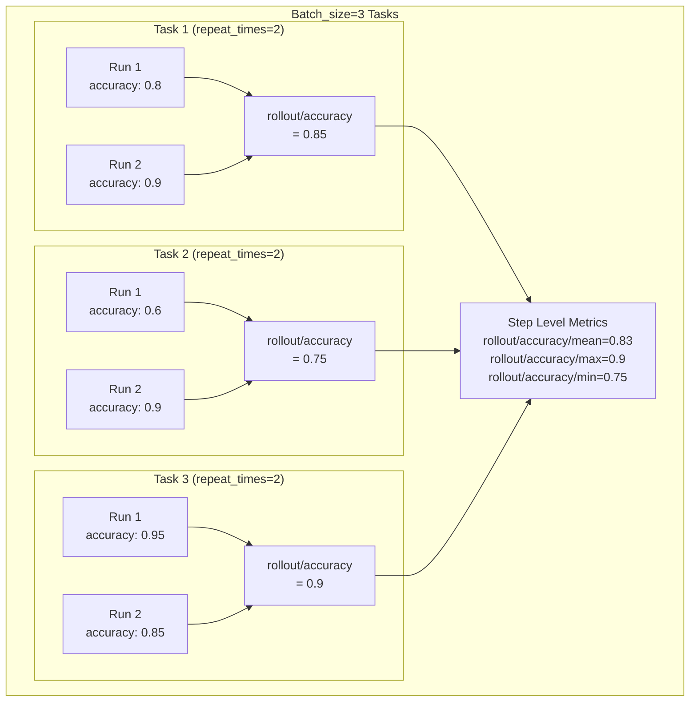
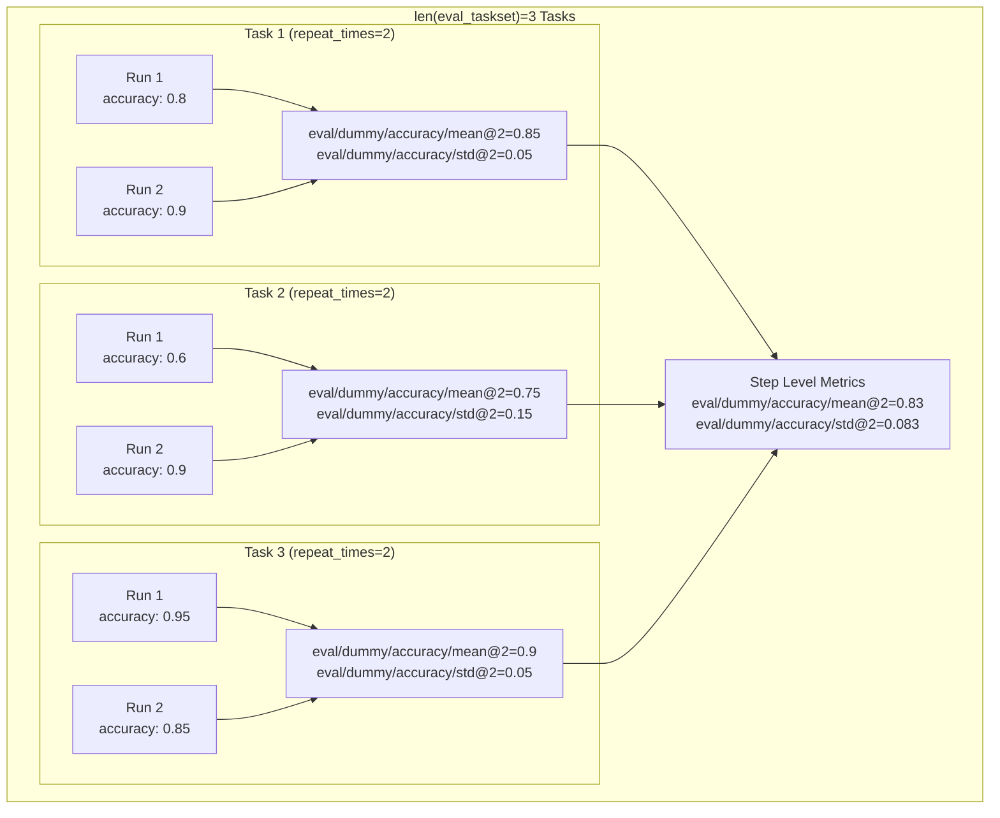
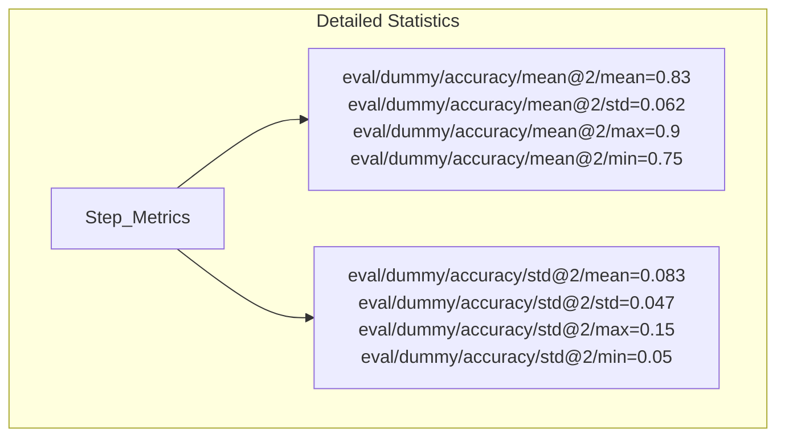
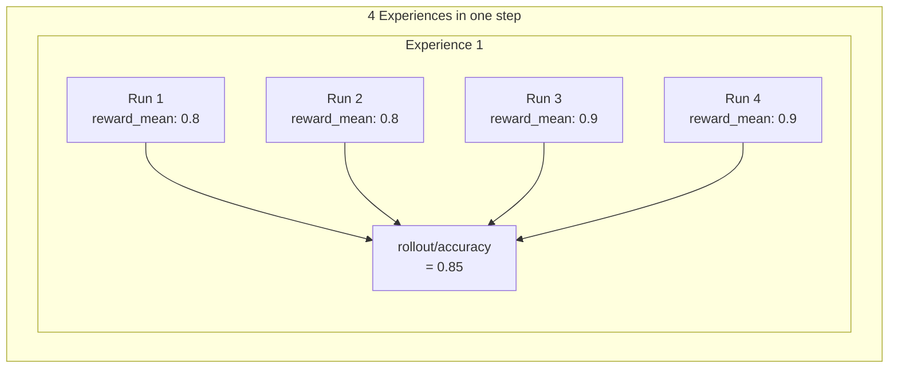

# Monitor Metrics Reference

This document provides an overview of the metric categories used in Trinity-RFT for tracking exploration, evaluation, and training progress.

## Metric Naming Convention

Most metrics follow a hierarchical naming convention: `{category}/{taskset_name}/{metric_name}/{statistic}`

- **Category**: Broad functional area (rollout, eval, time, actor, critic, etc.)
- **Taskset name**: Name of the taskset used, only applicable for eval metrics
- **Metric name**: Specific metric being measured
- **Statistic**: Aggregation method (mean, max, min, std, etc.) if applicable

## Metric Categories

In the following, metrics are categorized by their source component (where they are generated) and their metric prefix (the first part of the metric name).

### Explorer Metrics

Explorer metrics track performance during the rollout phase where the model generates responses, including rollout metrics (`rollout/`), eval metrics (`eval/`), and some time metrics (`time/`).

#### Rollout Metrics (`rollout/`)

Rollout metrics track performance during the rollout phase where the model generates responses.

- **Format**: `rollout/{metric_name}/{statistic}`
- **Examples**:
  - `rollout/accuracy/mean`: Average accuracy of generated responses
  - `rollout/format_score/mean`: Average format correctness score

**Metric Aggregation Process**:

Consider an exploration step with `batch_size` tasks, where each task has `repeat_times` runs. Rollout metrics (e.g., `rollout/`) are computed and aggregated at different levels:

- From *experiences* to *run level* (only effective for workflows with `can_repeat=False`): In `calculate_run_level_metrics` function, metrics are aggregated across all experiences generated by each run. This usually accounts for the general multi-turn workflow scenario where a single run may produce multiple experiences.

- From *run level* to *task level*: In `calculate_task_level_metrics` function, metrics are aggregated across `repeat_times` runs of the same task. For example, `rollout/accuracy` is the average accuracy of all runs of the task.

- From *task level* to *step level*: In `gather_metrics` function, metrics are aggregated across all tasks in the step. For example, `rollout/accuracy/mean`, `rollout/accuracy/max`, `rollout/accuracy/min` are the average, max, and min accuracy (`rollout/accuracy`) of all tasks in the step.

The following diagram illustrates the aggregation process for rollout metrics:

#### Eval Metrics (`eval/`) and Benchmark Metrics (`bench/`)

Evaluation metrics measure model performance on held-out evaluation tasks. These metrics are computed during periodic evaluation runs.

- **Format**: `eval/{task_name}/{metric_name}/{statistic}` or `bench/{task_name}/{metric_name}/{statistic}`
- **Examples**:
  - `eval/gsm8k-eval/accuracy/mean@4`: Mean accuracy across repeat_times=4 runs
  - `bench/gsm8k-eval/accuracy/best@4`: Best accuracy value across repeat_times=4 runs

- **Note**:
  - Eval and bench metrics are computed in the same way, the only difference is the prefix of the metric name.
  - By default, only the *mean* of the metric is returned. If you want to return detailed statistics, you can set `monitor.detailed_stats` to `True` in the config.

**Metric Aggregation Process**:

Consider an evaluation step with `len(eval_taskset)` tasks, where each task has `repeat_times` runs. Evaluation metrics (e.g., `eval/`, `bench/`) are computed and aggregated at different levels:

- From *experiences* to *run level* (only effective for workflows with `can_repeat=False`): In `calculate_run_level_metrics` function, metrics are aggregated across all experiences generated by each run. This usually accounts for the general multi-turn workflow scenario where a single run may produce multiple experiences.

- From *run level* to *task level*: In `calculate_task_level_metrics` function, metrics are aggregated across `repeat_times` runs of the same task. For example, `eval/dummy/accuracy/mean@2` is the average accuracy of all runs of the task.

- From *task level* to *step level*: In `gather_eval_metrics` function, metrics are aggregated across all tasks in the step. For example, `eval/dummy/accuracy/mean@2`, `eval/dummy/accuracy/std@2`, `eval/dummy/accuracy/best@2`, `eval/dummy/accuracy/worst@2` are the average, std, best, and worst accuracy (`eval/dummy/accuracy`) of all tasks in the step.

The following diagram illustrates the aggregation process on a dummy dataset with three tasks for evaluation metrics. By default, `mean@k`, `std@k`, `best@k`, `worst@k` of the metrics across all evaluation tasks are reported. You can set `monitor.detailed_stats` to `True` in the config to return detailed statistics.

When you set `monitor.detailed_stats` to `True`, you will get detailed statistics including mean, std, min, max, as shown in the following diagram:

#### Time Metrics (`time/`)

Time metrics measure execution duration for various operations throughout the rollout process.

- **Format**: `time/{operation_name}`
- **Examples**:
  - `time/eval`: Time from the start of submitting evaluation tasks to the end of the evaluation phase; this duration includes both evaluation tasks and some rollout tasks.
  - `time/wait_explore_step`: Time to wait for one rollout step to complete.

**Note**:
  - Time measuring can be inaccurate due to the asynchronous nature of the rollout process, but it is still useful for monitoring the overall training progress.
  - Time metrics are reported in seconds unless otherwise specified.
  - Some training operations also report per-token timing metrics with the prefix `timing_per_token_ms/` (e.g., `timing_per_token_ms/update_actor`, `timing_per_token_ms/update_critic`, `timing_per_token_ms/adv`, `timing_per_token_ms/values`). These metrics normalize execution time by the number of tokens processed, providing efficiency measurements independent of batch size.

### Trainer Metrics

This category includes metrics that track the training dynamics of the policy (actor) model (`actor/`) and the value function (critic) model (`critic/`), as well as some performance metrics (`perf/`, `global_seqlen/`, `response_length/`, `prompt_length/`, `time/`). These metrics are adapted from [veRL](https://github.com/volcengine/verl). Interested users can refer to the [veRL documentation](https://verl.readthedocs.io/en/latest/index.html) for more details.

### Data Processing Metrics

This category includes metrics that track the processing of experiences through various pipeline operators (`experience_pipeline/`) and data sampling statistics (`sample/`). These metrics are aggregated at the step level, as the experience pipeline and data sampling are performed in each step.

#### Experience Pipeline Metrics (`experience_pipeline/` and `time/experience_pipeline/`)

Experience pipeline metrics track the processing of experiences through various pipeline operators. Each metric represents the count of the specific operator in one step.

- **Format**: `experience_pipeline/{metric_name}`
- **Examples**:
  - `experience_pipeline/experience_count`: Number of experiences processed
  - `experience_pipeline/group_advantages/reward_mean/mean`: Here `reward_mean` is the mean reward of each task, then we compute the mean of the mean rewards of all tasks in the step.

The following diagram illustrates the aggregation process for data processing metrics:

#### Sample Metrics (`sample/`)

Sample metrics track data sampling statistics during training.

- **Format**: `sample/{metric_name}`
- **Examples**:
  - `sample/model_version/mean`: Mean model version of sampled experiences
  - `sample/task_count`: Number of tasks in the sampled batch
