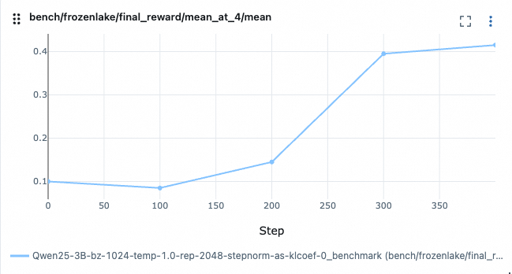

# Frozen Lake Agent

This example shows the implementation of a Frozen Lake agent using the Agentscope framework. The agent is designed to navigate a frozen lake environment by interpreting observations and selecting appropriate actions.

The data preparation and environment setup are the same as those in the [GRPO Frozen Lake example](../grpo_frozen_lake/README.md). Please follow the instructions there to set up the environment and prepare the dataset.


## Results

The configuration file for this example is located at [`frozenlake_agent.yaml`](./frozenlake_agent.yaml). We use Qwen2.5-3B-Instruct as the base LLM for the agent.

The training and evaluation dataset is generated using the same process as described in the [GRPO Frozen Lake example](../grpo_frozen_lake/README.md) with the following command:

```bash
cd examples/grpo_frozen_lake
python get_frozen_lake_data.py --test_size 50 --map_max_size 10
```

The training result is shown below, demonstrating the reward during training and evaluation phases:



