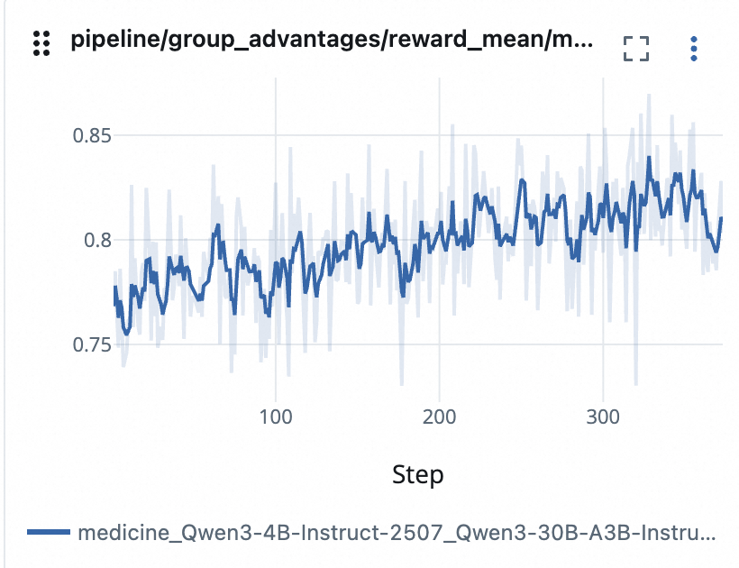

# Non-Verifiable Medicine QA

This example shows how to use LLM judge and rubrics to compute reward for a non-verifiable medicine QA task. This is inspired by the [RaR-Implicit](https://arxiv.org/pdf/2507.17746) method.

Before running this example, please make sure you have prepared the environment and the dataset [anisha2102/RaR-Medicine](https://huggingface.co/datasets/anisha2102/RaR-Medicine).

The RaR-Medicine dataset contains around 20k QA pairs with rubrics in medicine domain. Unlike math scenarios, it is infeasible to obtain verifiable rewards for this dataset. Below is an example data sample:

```json
{
    "question": "What is the most sensitive imaging modality for diagnosing a ureteric stone in a patient presenting with acute renal colic?",
    "reference_answer": "The most sensitive imaging modality for diagnosing a ureteric stone in a patient presenting with acute renal colic is a non-contrast helical CT scan. This method is highly accurate, able to detect stones of varying sizes and compositions, and preferred due to its quick and reliable results without the need for contrast, making it the gold standard in such cases.",
    "rubric": [
        {
            "description": "Essential Criteria: Identifies non-contrast helical CT scan as the most sensitive modality for ureteric stones.",
            "title": "Identify Most Sensitive Modality",
            "weight": 5
        },
        ...
    ]
}
```

In the RaR-Implicit method, the LLM judge scores a group of responses by evaluating them against the provided rubrics and outputs the score in the range of [0, 1] for each response. The higher the score, the better the response is according to the rubrics.


The config file is located in [`rubric.yaml`](./rubric.yaml).
To run this example, you can run the following command:
```bash
trinity run --config examples/grpo_rubric_as_reward/rubric.yaml
```

With the provided configurations, we can see the reward is increasing over the training steps:


