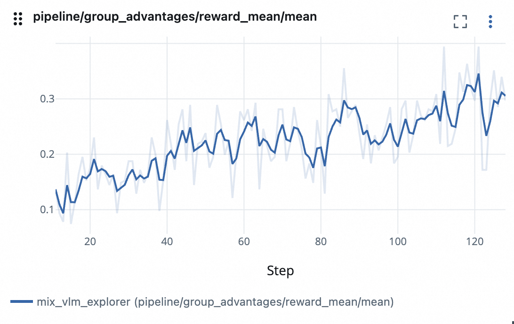

# MIX algorithm with VLM

This is an example of using the [MIX](../../docs/sphinx_doc/source/tutorial/example_mix_algo.md) algorithm with Qwen2.5-VL-3B-Instruct model.

> [!NOTE]
> This feature is experimental and will be subject to change in future releases.

The specific requirements are:

```yaml
vllm>=0.9.1,<0.10.0
transformers<4.53.0
qwen_vl_utils
```

## Prepare the SFT Dataset
We use the [geometry3k](https://huggingface.co/datasets/hiyouga/geometry3k) dataset for training; we generate the [SFT dataset](https://huggingface.co/datasets/datajuicer/geometry_sft) by prompting Qwen2.5-VL-32B-Instruct model on the validation set. Note that this dataset only showcases the format of SFT data in this example, as shown below:
```json
{
    "problem": "<image>Find $x$ so that $m || n$.",
    "response": "To determine the value of $ x $ ... Answer:\n\\[\n\\boxed{63}\n\\]",
    "images": [<image>]
}
```

The config file is located in [`mix_vlm.yaml`](mix_vlm.yaml). To get better performance, feel free to try out different algorithm hyperparameters!

## Run the Example

Run the following command to start the training:
```bash
trinity run --config examples/mix_vlm/mix_vlm.yaml
```

The reward curve is shown below:

