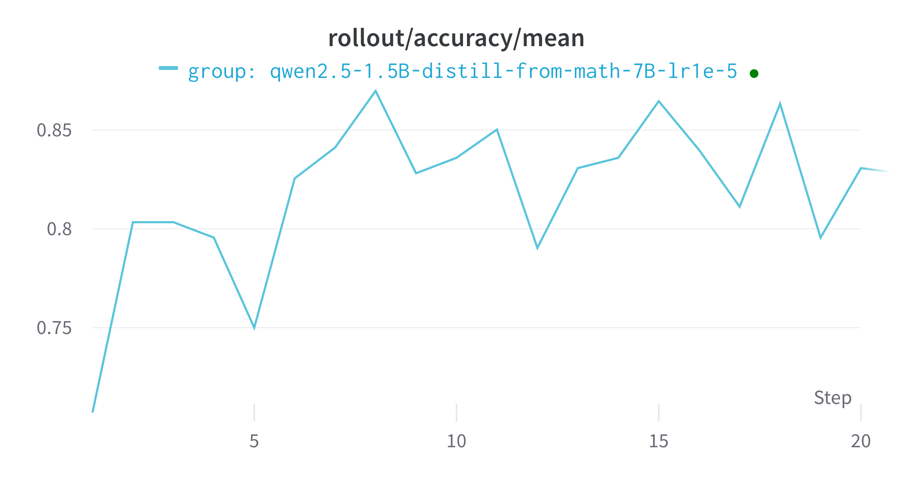
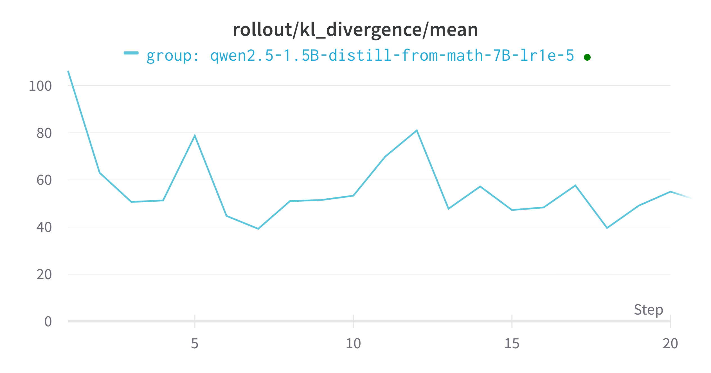
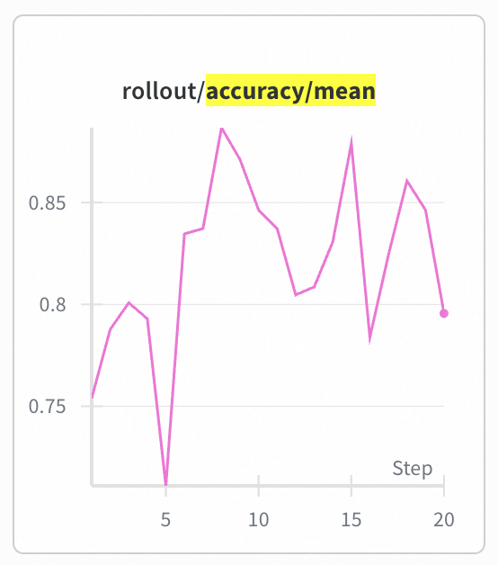
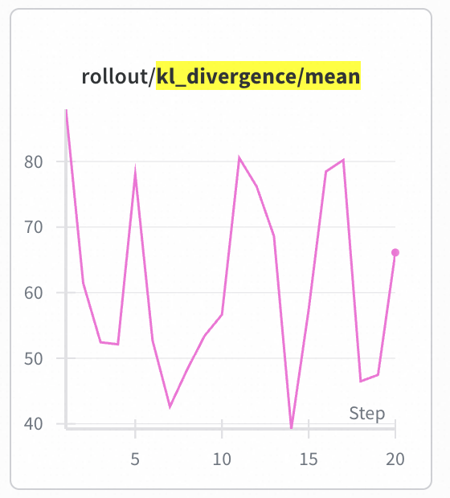

# Example: On-Policy Distillation on GSM8K dataset

This example demonstrates On-Policy Distillation (OPD) algorithm training on the GSM8K dataset.

On-Policy Distillation is a knowledge distillation method, where in this example:
1. **Student model** (`Qwen/Qwen2.5-1.5B-Instruct`) generates trajectories with logprobs
2. **Teacher model** (`Qwen/Qwen2.5-Math-7B-Instruct`) computes logprobs on the same trajectories
3. The advantage is computed as: `advantages = kl_coef * (teacher_logprobs - student_logprobs)`
4. The student model is trained to minimize this KL divergence, effectively learning from the teacher

## Algorithm Variants

### 1. On-Policy Distill (KL-based)

Uses KL divergence for advantage computation:
- **Algorithm**: `on_policy_distill`
- **Workflow**: `on_policy_distill_workflow`
- **Advantage**: `advantages = kl_coef * (teacher_logprobs - student_logprobs)`
- **Config file**: `opd_gsm8k.yaml`

### 2. JSD (Jensen-Shannon Divergence)

Uses Jensen-Shannon Divergence for advantage computation:
- **Algorithm**: `jsd`
- **Workflow**: `on_policy_distill_math_workflow`
- **Advantage**: `advantages = -kl_coef * JSD`, where `JSD(P||Q) = lambda_coef * KL(P||M) + (1-lambda_coef) * KL(Q||M)` and `M = (P+Q)/2`
- **Parameters**:
  - `kl_coef`: Overall scaling coefficient for advantages (default: 1.0)
  - `lambda_coef`: Weight for mixing KL(P||M) and KL(Q||M) in JSD (default: 0.5). When lambda=0.5, this gives the standard symmetric JSD.
- **Config file**: `opd_gsm8k_jsd.yaml`

## Key Configuration

- **Student Model**: `Qwen/Qwen2.5-1.5B-Instruct`
- **Teacher Model**: `Qwen/Qwen2.5-Math-7B-Instruct` (configured as auxiliary model)

## Running the Example

Download the model checkpoint and modify your config file, then run:

For KL-based OPD:
```bash
trinity run examples/opd_gsm8k/opd_gsm8k.yaml
```

For JSD-based OPD:
```bash
trinity run examples/opd_gsm8k/opd_gsm8k_jsd.yaml
```

Then you are all set! It should be pretty simple😄, and the training should converge very quick.


### KL-based OPD Results




### JSD-based OPD Results




## References

- https://arxiv.org/pdf/2306.13649
- https://thinkingmachines.ai/blog/on-policy-distillation/
