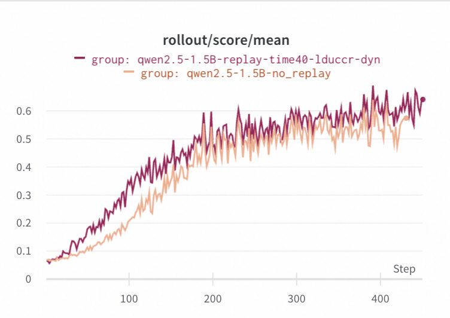

# Example: PPO on Countdown dataset with experience replay

In this example, we follow the main settings in [`ppo_countdown`](../ppo_countdown/README.md),
and demonstrate the **experience replay** mechanisms in Trinity-RFT.

### Motivations

One motivation for experience replay is that, it is often desirable to improve learning efficiency by reusing the rollout samples for multiple training steps, especially in scenarios where rollout (with agent-environment interaction) is slow or expensive.
Moreover, experience replay offers a straightforward method for filling pipeline bubbles in the trainer (caused by discrepencies between explorer's and trainer's speeds) with useful computation, improving hardware utilization for the disaggregated architecture adopted by Trinity (and many other RL systems).

### Implementation and configuration

The priority queue buffer in Trinity offers seamless support for experience replay.
Whenever a batch of highest-priority samples are retrieved from the buffer,
a **priority function** updates their priority scores and decide which one should be put back into the buffer (after `reuse_cooldown_time` seconds have passed) for replay.
Users of Trinity can implement and register their own customized priority functions,
which can then be called by setting the `priority_fn` field in the yaml config.

We present an example config file in [`countdown.yaml`](./countdown.yaml),
where 1 GPU is allocated to the explorer and 6 GPUs to the trainer,
simulating a scenario where agent-environment interaction is slow and rollout data is scarce.
Important config parameters for experience replay include:
* `buffer.trainer_input.experience_buffer.storage_type`: set to `queue`
* `buffer.trainer_input.experience_buffer.replay_buffer`
  * `enable`: set to `true` for enabling priority queue buffer
  * `reuse_cooldown_time`: delay time (in seconds) before putting sample back into the buffer; must be set explicitly
  * `priority_fn`: name of the priority function
  * `priority_fn_args`: additional args for the priority function
* `synchronizer.sync_style`: set to `explorer_driven`, which allows the trainer to run more training steps as long as the priority queue buffer is non-empty

The priority function used in this example is named `decay_limit_randomization`.
The logic behind it:
* Priority score is calculated as `model_version - decay * use_count`, i.e., fresher and less used samples are prioritized;
* If `sigma` is non-zero, priority score is further perturbed by random Gaussian noise with standard deviation `sigma`;
* A retrieved sample will be put back into the buffer if and only if its use count has not exceeded `use_count_limit`.

### Experimental results

We conduct experiment for this config, and compare it with a baseline config that uses each rollout sample exactly once for training.
The first and second figures below --- using rollout step or wall-clock time as the X-axis ---  confirms the benefits brought by experience replay (with default hyperparameters).
This is partly because more training steps can be taken, as shown in the third figure (where X-axis represents rollout step).

